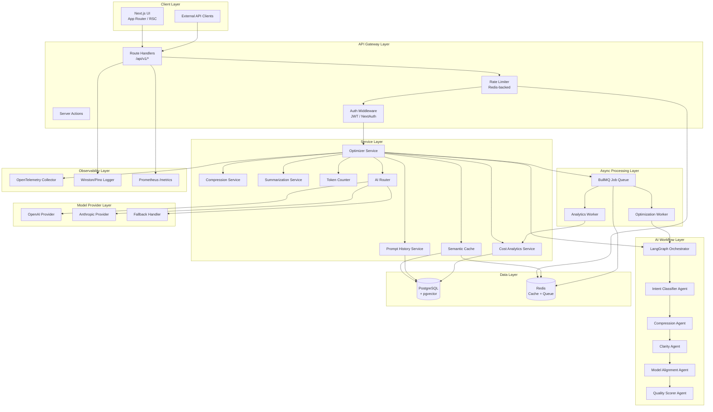
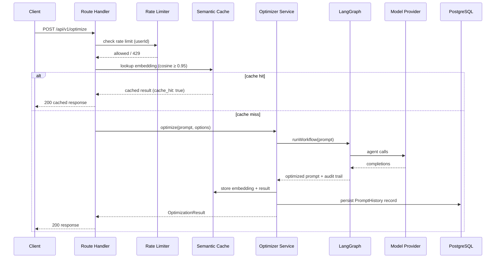
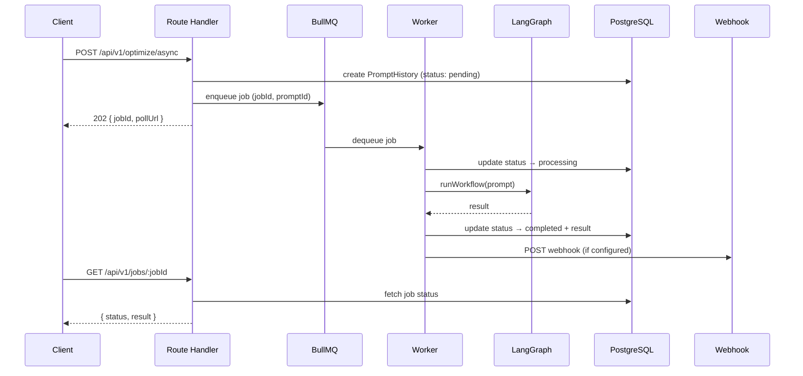
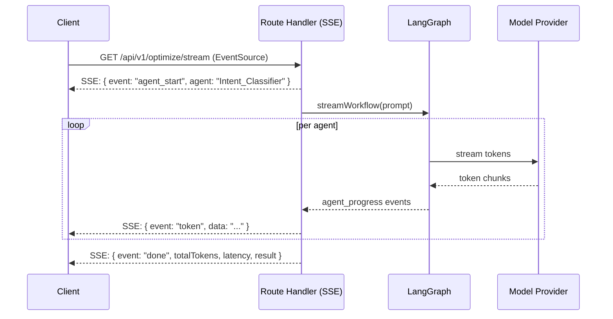
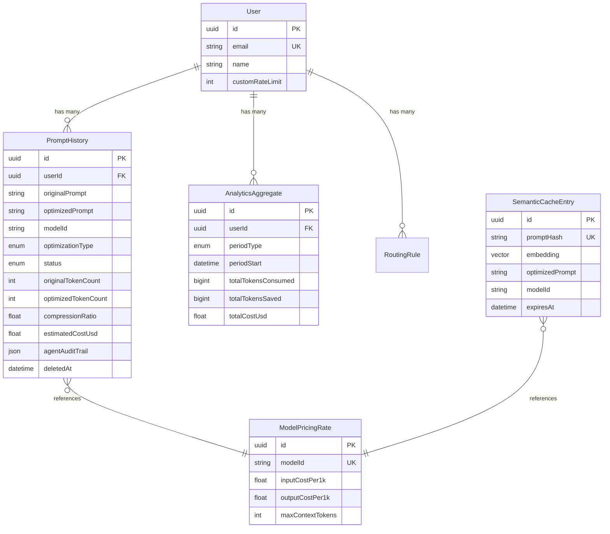

# Design Document: AI Prompt Optimization Platform

## Overview

The AI Prompt Optimization Platform is a production-ready, enterprise-grade web application that enables developers and teams to compress, optimize, analyze, and manage AI prompts across multiple language models. It reduces token usage and cost through semantic compression, context summarization, and model-specific optimization while providing full observability into prompt history, cost analytics, and AI routing decisions.

### Goals

- Reduce AI inference costs by compressing and optimizing prompts before they reach model providers
- Provide a multi-agent LangGraph pipeline that applies specialized transformations at each stage
- Deliver real-time streaming output and asynchronous job processing for long-running workflows
- Offer full observability (tracing, metrics, structured logging) suitable for enterprise SLA compliance
- Expose a versioned, schema-validated REST API with OpenAPI 3.1 documentation

### Non-Goals

- The platform does not train or fine-tune AI models
- The platform does not manage model provider billing accounts directly
- The platform does not provide a general-purpose LLM chat interface

### Key Design Decisions

| Decision | Choice | Rationale |
|---|---|---|
| Web framework | Next.js 15 App Router | Unified SSR/API surface, React Server Components, built-in streaming |
| ORM | Prisma + PostgreSQL | Type-safe queries, migration tooling, pgvector extension support |
| AI orchestration | LangGraph (LangChain) | Stateful multi-agent graphs with built-in retry and error handling |
| Queue | BullMQ + Redis | Battle-tested job queue with priority, retries, and concurrency control |
| Validation | Zod | Runtime schema validation with TypeScript inference |
| Observability | OpenTelemetry + Winston/Pino + Prometheus | Industry-standard, vendor-neutral telemetry stack |
| Dependency injection | `tsyringe` | Lightweight DI container compatible with TypeScript decorators |
| Token counting | `tiktoken` (OpenAI) + Anthropic tokenizer | Exact token counts per model family |

---

## Architecture

### High-Level System Architecture



### Request Flow — Synchronous Optimization



### Request Flow — Asynchronous Job



### Streaming Flow



---

## Components and Interfaces

### Folder Structure

```
src/
├── app/                          # Next.js App Router
│   ├── (dashboard)/              # Dashboard route group
│   │   ├── analytics/
│   │   ├── history/
│   │   └── optimize/
│   ├── api/
│   │   ├── v1/
│   │   │   ├── optimize/
│   │   │   │   ├── route.ts      # POST /api/v1/optimize
│   │   │   │   ├── async/route.ts
│   │   │   │   └── stream/route.ts
│   │   │   ├── tokens/route.ts
│   │   │   ├── history/route.ts
│   │   │   ├── analytics/route.ts
│   │   │   ├── jobs/[jobId]/route.ts
│   │   │   └── routing-rules/route.ts
│   │   ├── docs/route.ts         # OpenAPI spec
│   │   └── metrics/route.ts      # Prometheus metrics
│   ├── layout.tsx
│   └── page.tsx
│
├── components/                   # React UI components
│   ├── ui/                       # shadcn/ui primitives
│   ├── prompt/
│   │   ├── PromptEditor.tsx
│   │   ├── OptimizationResult.tsx
│   │   └── StreamingOutput.tsx
│   ├── analytics/
│   │   ├── CostChart.tsx
│   │   └── TokenSavingsChart.tsx
│   └── history/
│       └── HistoryTable.tsx
│
├── lib/                          # Core infrastructure
│   ├── config/
│   │   ├── env.ts                # Zod env validation
│   │   └── app.config.ts         # Typed app config
│   ├── logger/
│   │   ├── logger.ts             # Winston/Pino instance
│   │   └── correlation.ts        # Correlation ID middleware
│   ├── telemetry/
│   │   ├── tracer.ts             # OpenTelemetry setup
│   │   └── metrics.ts            # Prometheus metrics registry
│   ├── db/
│   │   ├── prisma.ts             # Prisma client singleton
│   │   └── migrations/
│   ├── redis/
│   │   └── client.ts             # Redis client singleton
│   ├── queue/
│   │   ├── queue.ts              # BullMQ queue definitions
│   │   └── workers/
│   │       ├── optimization.worker.ts
│   │       └── analytics.worker.ts
│   ├── di/
│   │   └── container.ts          # tsyringe DI container
│   ├── errors/
│   │   ├── AppError.ts           # Base error class
│   │   ├── ValidationError.ts
│   │   └── error-handler.ts      # Global error handler
│   └── api/
│       ├── response.ts           # Standardized API response builder
│       └── middleware.ts         # Composed middleware chain
│
├── services/                     # Business logic services
│   ├── optimizer/
│   │   ├── OptimizerService.ts
│   │   └── optimizer.types.ts
│   ├── compression/
│   │   ├── CompressionService.ts
│   │   └── compression.types.ts
│   ├── summarization/
│   │   ├── SummarizationService.ts
│   │   └── summarization.types.ts
│   ├── token-counter/
│   │   ├── TokenCounterService.ts
│   │   └── token-counter.types.ts
│   ├── semantic-cache/
│   │   ├── SemanticCacheService.ts
│   │   └── semantic-cache.types.ts
│   ├── ai-router/
│   │   ├── AIRouterService.ts
│   │   ├── routing-rules.ts
│   │   └── ai-router.types.ts
│   ├── prompt-history/
│   │   ├── PromptHistoryService.ts
│   │   └── prompt-history.types.ts
│   └── cost-analytics/
│       ├── CostAnalyticsService.ts
│       └── cost-analytics.types.ts
│
├── workflows/                    # LangGraph multi-agent workflows
│   ├── optimization/
│   │   ├── graph.ts              # LangGraph graph definition
│   │   ├── state.ts              # Workflow state schema
│   │   └── agents/
│   │       ├── intent-classifier.ts
│   │       ├── compression-agent.ts
│   │       ├── clarity-agent.ts
│   │       ├── model-alignment-agent.ts
│   │       └── quality-scorer.ts
│   └── streaming/
│       └── stream-handler.ts
│
├── providers/                    # Model provider abstractions
│   ├── base/
│   │   └── ModelProvider.ts      # Abstract base class / interface
│   ├── openai/
│   │   └── OpenAIProvider.ts
│   ├── anthropic/
│   │   └── AnthropicProvider.ts
│   └── registry.ts               # Provider registry
│
├── schemas/                      # Zod validation schemas
│   ├── optimize.schema.ts
│   ├── token-count.schema.ts
│   ├── history.schema.ts
│   ├── analytics.schema.ts
│   └── common.schema.ts
│
└── types/                        # Shared TypeScript types
    ├── api.types.ts
    ├── models.types.ts
    └── workflow.types.ts
```

### Core Service Interfaces

```typescript
// Model Provider abstraction
interface IModelProvider {
  readonly providerId: string;
  readonly supportedModels: string[];
  complete(request: CompletionRequest): Promise<CompletionResponse>;
  stream(request: CompletionRequest): AsyncIterable<CompletionChunk>;
  countTokens(text: string, model: string): Promise<number>;
}

// Optimizer Service
interface IOptimizerService {
  optimize(request: OptimizeRequest): Promise<OptimizationResult>;
  optimizeAsync(request: OptimizeRequest): Promise<AsyncJobResponse>;
  optimizeStream(request: OptimizeRequest): AsyncIterable<StreamEvent>;
}

// Compression Service
interface ICompressionService {
  compress(prompt: string, model: string): Promise<CompressionResult>;
}

// Summarization Service
interface ISummarizationService {
  summarize(messages: Message[]): Promise<SummarizationResult>;
}

// Token Counter Service
interface ITokenCounterService {
  count(text: string, model: string): Promise<TokenCountResult>;
  getSupportedModels(): string[];
}

// Semantic Cache Service
interface ISemanticCacheService {
  lookup(prompt: string, threshold?: number): Promise<CacheEntry | null>;
  store(prompt: string, result: OptimizationResult, ttl?: number): Promise<void>;
  invalidateByModel(modelId: string): Promise<void>;
}

// AI Router Service
interface IAIRouterService {
  route(request: RoutingRequest): Promise<RoutingDecision>;
  getRoutingRules(): Promise<RoutingRule[]>;
  updateRoutingRules(rules: RoutingRule[]): Promise<void>;
}

// Prompt History Service
interface IPromptHistoryService {
  create(data: CreateHistoryEntry): Promise<PromptHistoryEntry>;
  findMany(filters: HistoryFilters, pagination: Pagination): Promise<PaginatedResult<PromptHistoryEntry>>;
  search(query: string, pagination: Pagination): Promise<PaginatedResult<PromptHistoryEntry>>;
  softDelete(id: string, userId: string): Promise<void>;
  updateStatus(id: string, status: JobStatus, data?: Partial<PromptHistoryEntry>): Promise<void>;
}

// Cost Analytics Service
interface ICostAnalyticsService {
  getAnalytics(userId: string, period: AnalyticsPeriod): Promise<CostAnalyticsResult>;
  updateAggregates(promptHistoryId: string): Promise<void>;
}
```

### API Response Standardization

All API responses conform to a consistent envelope:

```typescript
// Success response
interface ApiSuccessResponse<T> {
  success: true;
  data: T;
  schema_version: string;       // e.g. "1.0"
  request_id: string;           // correlation ID
  timestamp: string;            // ISO 8601
}

// Error response
interface ApiErrorResponse {
  success: false;
  error: {
    code: string;               // machine-readable error code
    message: string;            // human-readable message
    details?: Record<string, unknown>; // field-level validation errors
  };
  schema_version: string;
  request_id: string;
  timestamp: string;
}
```

### Rate Limiting Headers

Every API response includes:

```
X-RateLimit-Limit: 60
X-RateLimit-Remaining: 45
X-RateLimit-Reset: 1704067200
```

---

## Data Models

### Prisma Schema

```prisma
// prisma/schema.prisma

generator client {
  provider        = "prisma-client-js"
  previewFeatures = ["postgresqlExtensions"]
}

datasource db {
  provider   = "postgresql"
  url        = env("DATABASE_URL")
  extensions = [pgvector(map: "vector")]
}

model User {
  id              String           @id @default(uuid())
  email           String           @unique
  name            String?
  customRateLimit Int?
  createdAt       DateTime         @default(now())
  updatedAt       DateTime         @updatedAt
  promptHistory   PromptHistory[]
  analyticsAgg    AnalyticsAggregate[]
  routingRules    RoutingRule[]

  @@map("users")
}

model PromptHistory {
  id                    String          @id @default(uuid())
  userId                String
  user                  User            @relation(fields: [userId], references: [id])
  originalPrompt        String
  optimizedPrompt       String?
  modelId               String
  optimizationType      OptimizationType
  status                JobStatus       @default(PENDING)
  jobId                 String?         @unique
  webhookUrl            String?
  originalTokenCount    Int?
  optimizedTokenCount   Int?
  compressionRatio      Float?
  estimatedCostUsd      Float?
  costSavingsUsd        Float?
  compressionSkipped    Boolean         @default(false)
  summarizationSkipped  Boolean         @default(false)
  contextOverflowHandled Boolean        @default(false)
  cacheHit              Boolean         @default(false)
  cacheSimilarityScore  Float?
  agentAuditTrail       Json?           // per-agent metadata array
  routingDecision       Json?           // routing rationale
  errorDetails          Json?
  workerStartedAt       DateTime?
  completedAt           DateTime?
  deletedAt             DateTime?       // soft delete
  createdAt             DateTime        @default(now())
  updatedAt             DateTime        @updatedAt

  @@index([userId, createdAt])
  @@index([userId, modelId])
  @@index([userId, optimizationType])
  @@index([deletedAt])
  @@map("prompt_history")
}

model SemanticCacheEntry {
  id              String                  @id @default(uuid())
  promptHash      String                  @unique  // SHA-256 of original prompt
  embedding       Unsupported("vector(1536)")
  originalPrompt  String
  optimizedPrompt String
  modelId         String
  hitCount        Int                     @default(0)
  expiresAt       DateTime
  createdAt       DateTime                @default(now())
  updatedAt       DateTime                @updatedAt

  @@index([expiresAt])
  @@map("semantic_cache_entries")
}

model AnalyticsAggregate {
  id                  String    @id @default(uuid())
  userId              String
  user                User      @relation(fields: [userId], references: [id])
  periodType          PeriodType
  periodStart         DateTime
  totalTokensConsumed BigInt    @default(0)
  totalTokensSaved    BigInt    @default(0)
  totalCostUsd        Float     @default(0)
  totalRequests       Int       @default(0)
  avgCompressionRatio Float?
  createdAt           DateTime  @default(now())
  updatedAt           DateTime  @updatedAt

  @@unique([userId, periodType, periodStart])
  @@index([userId, periodType, periodStart])
  @@map("analytics_aggregates")
}

model ModelPricingRate {
  id              String    @id @default(uuid())
  modelId         String    @unique
  inputCostPer1k  Float     // USD per 1,000 input tokens
  outputCostPer1k Float     // USD per 1,000 output tokens
  maxContextTokens Int
  provider        String
  isActive        Boolean   @default(true)
  createdAt       DateTime  @default(now())
  updatedAt       DateTime  @updatedAt

  @@map("model_pricing_rates")
}

model RoutingRule {
  id              String    @id @default(uuid())
  userId          String?   // null = global rule
  user            User?     @relation(fields: [userId], references: [id])
  priority        Int       @default(0)
  taskType        String?
  maxCostUsd      Float?
  maxLatencyMs    Int?
  preferredModel  String?
  fallbackModel   String?
  isActive        Boolean   @default(true)
  createdAt       DateTime  @default(now())
  updatedAt       DateTime  @updatedAt

  @@index([userId, priority])
  @@map("routing_rules")
}

enum OptimizationType {
  COMPRESSION
  SUMMARIZATION
  MULTI_AGENT
  MODEL_SPECIFIC
  TOKEN_COUNT
}

enum JobStatus {
  PENDING
  PROCESSING
  COMPLETED
  FAILED
}

enum PeriodType {
  DAY
  WEEK
  MONTH
}
```

### Key Data Relationships



---

## Correctness Properties

